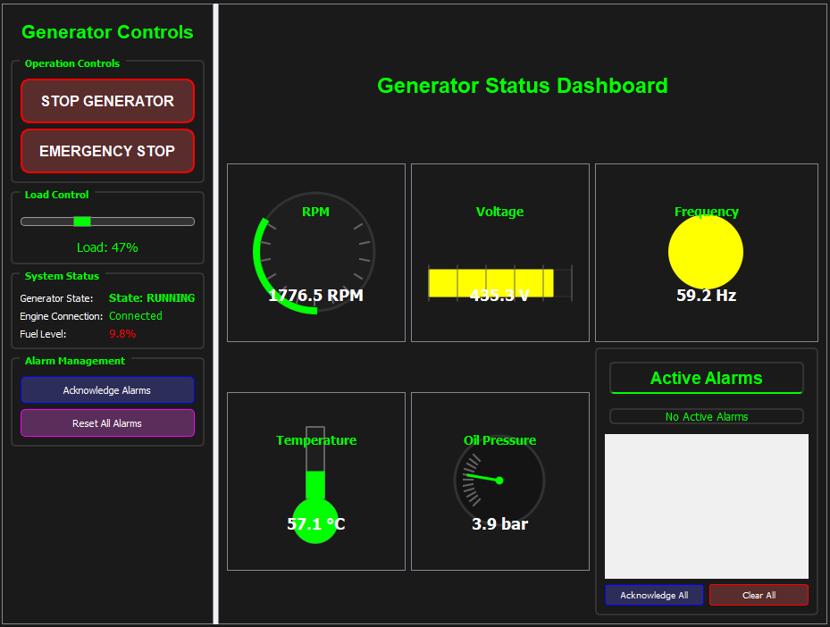

# Marine Generator Simulator - Engine

A C++17 simulation engine for modeling marine generator behavior with realistic sensor simulation and TCP socket communication.



*GUI under development

## Features

- **Realistic generator simulation**: Models generator states (STOPPED, STARTING, RUNNING, STOPPING, FAULT)
- **Sensor simulation**: RPM, voltage, frequency, temperature, oil pressure, fuel level with noise and drift
- **Load management**: Dynamic load control with minimum 20% requirement when running
- **Alarm system**: Threshold-based alarms for critical parameters
- **TCP socket server**: JSON-based communication protocol for external clients
- **Real-time updates**: Continuous simulation loop with configurable update rates

## Project Structure

```
engine/
├── include/           # Header files
│   ├── Generator.h   # Main generator class
│   └── Sensors.h     # Sensor simulation classes
├── src/              # Source files
│   ├── Generator.cpp # Generator implementation
│   ├── Sensors.cpp   # Sensor implementation
│   └── main.cpp      # Main server and socket handling
├── CMakeLists.txt    # Build configuration
└── README.md         # This file
```

## Requirements

- **Compiler**: C++17 compatible (MSVC 2017+, GCC 7+, Clang 5+)
- **Build system**: CMake 3.10+
- **Platform**: Windows, Linux, macOS
- **Dependencies**: Standard library only (no external dependencies)

## Building

### Windows (Visual Studio)
```bash
mkdir build
cd build
cmake .. -G "Visual Studio 16 2019" -A x64
cmake --build . --config Release
```

### Windows (MinGW)
```bash
mkdir build
cd build
cmake .. -G "MinGW Makefiles"
cmake --build .
```

### Linux/macOS
```bash
mkdir build
cd build
cmake ..
make
```

## Running

After building, the executable will be in `build/bin/Release/` (Windows) or `build/` (Linux/macOS):

```bash
./generator-simulator.exe  # Windows
./generator-simulator      # Linux/macOS
```

The engine will start a TCP server on port 8081.

## Communication protocol

The engine accepts simple text commands over TCP:

- `start` - Start the generator
- `stop` - Stop the generator
- `emergency_stop` - Emergency shutdown
- `set_load <percentage>` - Set load (20-100% when running)
- `status` - Get current status

### Status response format

```json
{
  "status": "success",
  "data": {
    "state": 2,
    "rpm": 1800.0,
    "voltage": 440.0,
    "frequency": 60.0,
    "load": 75.0,
    "fuel_level": 100.0,
    "oil_pressure": 45.0,
    "cooling_temp": 85.0,
    "alarms": []
  }
}
```

### State values
- `0`: STOPPED
- `1`: STARTING
- `2`: RUNNING
- `3`: STOPPING
- `4`: FAULT

## Configuration

Key simulation parameters can be adjusted in `include/Sensors.h`:

- `FUEL_CONSUMPTION_RATE`: Fuel consumption per second (default: 0.001%)
- `SENSOR_NOISE_LEVEL`: Random noise added to sensor readings
- `CALIBRATION_DRIFT_RATE`: Sensor calibration drift over time

## Testing

Basic functionality can be tested using any TCP client:

```bash
# Using netcat (Linux/macOS)
echo "start" | nc localhost 8081
echo "status" | nc localhost 8081
echo "set_load 75" | nc localhost 8081
```

## Development status

- Complete generator state machine
- Realistic sensor simulation
- TCP communication protocol
- Load management system
- Alarm handling
- Cross-platform compatibility

## Future enhancements

- Multiple generator support
- Data logging and export
- Configuration file support
- Performance optimization
- Extended sensor types
- Graphical user interface

## License

MIT
